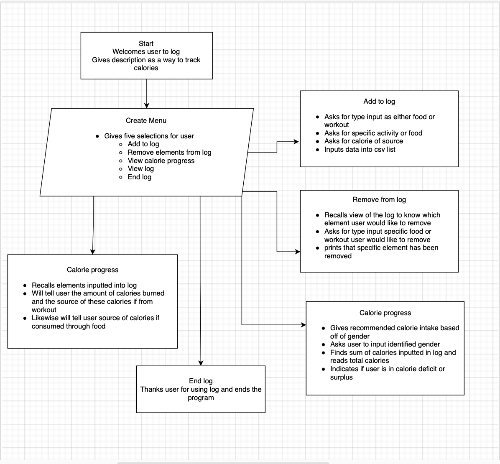

# Calorie Log Application

## Provide full attribution to referenced sources (where applicable).
Pypi - pip (colored installed)
NHS - information related to calorie intake recommendations

## Provide a link to your source control repository
git@github.com:wesken98/2023-MAY-T1A3.git
https://github.com/wesken98/2023-MAY-T1A3.git
Link to presentation: https://vimeo.com/827864272?share=copy

## Identify any code style guide or styling conventions that the application will adhere to. Reference the chosen style guide appropriately.

My log uses the Python colored package installed through pip. Styling conventions including 'reset' are defined at the top of each page to make it easier to recall these functions.  Headers are in bold to differentiate the different features of the program. Invalid selections by users are underlined to make it easier for user to know where they went wrong. The calorie progress is also in bold and the initial menu has gold text to make navigation easy.

## List of features and description
### Add to log - 1
This feature allows the user to add elements to this log so that we can get an accurate telling of what calories the user has burned or gained throughout the day. All features of this program are defined using def and called in the menu or home screen of the program. Initially this feature asks the user whether they would like to input a workout or food option. Using an if/else statement, depending on the choice, a couple local variables are created (workout/food, and calories) that will ask the user the specific workout or food choice they did/ate throughout the day and how many calories (int variable) each one contained. Within these statements I opened the csv list and wrote the specific workout or food  and calories recorded. I made sure to include the calories of workouts as a negative value so that when the total values of the calories would be calculated correctly. Included in the conditional statements are also try and except blocks, so if the user accidentally puts in a string for the int value intended for calories, the program will give back a ValueError that will not break the program.
### View log - 4
Another feature allows the user to review the existing log of elements they have already put in. All features are defined variables that are recalled in the selection of the menu. This specific one opens the csv file in read mode, which can't manipulate variables within the log list. A local variable is defined, reader, and uses a function of csv (reader), to view elements of the log. It skips the first list established in the csv file that doesn't account for the specific workout or food inputted by the user. It then uses a for loop to run through each element of each given list. If an element in the first index is negative, it prints out the positive value of the integer and tells the user how many calories they burned doing a specific exercise. The same goes with the specific food catalogued along with the calories consumed using if/else statements.
### Calorie progress - 3
Upon selecting this function, the program shows the user a recommended guide of what their daily calorie log should look like for the day and asks the user to input the gender they most identify with to see if their calories are aligned with the recommended guide. I used a for loop to run through each element of the lists created only accounting for the first index. Because the default is string I implicitly declared them as integers. Within the for loop, I was able to recall the global variable I made, sum = 0, and add each integer until each list was ran through and the total calories of the log were accounted for. Finally I used nested if/else statements and recalled both the global variables sum and gender to ensure the user would be given an accurate telling of whether or not they were in a calorie surplus or calorie deficit.

## Implementation Plan

## Design help documentation
In order to install the application, the program requires that the user run ./run.sh in the terminal. In doing so this creates a virtual environment of the program, installs the python package enabled through requirements.txt and runs the main page of the program, which is linked to the functions of the log. The program will guide user through selections prompted through the terminal and uses the network and packets to connect to github, which is where the repository is stored. A csv file creates lists of the log, which is recalled on throughout the program to define the calories and workout/food of the data inputted by the user.